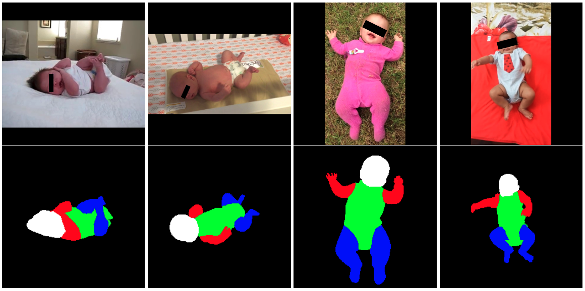

# Youtube-Infant-Body-Parsing
The infant video dataset collected from Youtube with body parsing annotations. The data and annotations are released for research purposes only.

<div align=center></div>

Dataset Description
-----
This dataset includes 90 infant movement videos collected from Youtube by [Chambers et al. (2020)](https://www.ncbi.nlm.nih.gov/pmc/articles/PMC8011647/). URLs of videos are provided in their [github](https://github.com/cchamber/Infant_movement_assessment). We downloaded videos and downsampled them every 4 frames due to the long length of original videos. Sampled frames are available on this [google drive](https://drive.google.com/file/d/1sm5Ril_2YT3cidSkCpL6EcXZPFf2eNSW/view?usp=sharing). The format of each frame name is `{7_digits_of_video_index}{6_digits_of_frame_index}`. For infant body parsing, we collect annotations for five classes: background, head, arm, torso and leg. We randomly split all videos into 68 training videos and 22 testing videos, resulting in 2,149 labeled and 4,690 unlabeled training frames, and 1,256 labeled and 2,737 unlabeled testing frames. They corresponds to `train_label.json`, `train_unlabel.json`, `test_label.json`, and `test_unlabel.json`, respectively. The following codes show how to use these json files and visualize the label images. Note that the data and annotations are released for research purposes only.

```python
import json
import base64
import numpy as np
import cv2

def base64tonpy(file):
    base64_decoded = base64.b64decode(file)
    im_arr = np.frombuffer(base64_decoded, dtype=np.uint8)
    img = cv2.imdecode(im_arr, flags=cv2.IMREAD_COLOR)
    return img[:, :, ::-1]
    
def im2vl(img):
    img_tmp = np.zeros(img.shape[:2], dtype=np.uint8)
    head_msk = np.all(img == [44, 160, 44], axis=2)
    hand_msk = np.all(img == [31, 119, 180], axis=2)
    body_msk = np.all(img == [255, 127, 14], axis=2)
    foot_msk = np.all(img == [214, 39, 40], axis=2)
    img_tmp[head_msk] = 1
    img_tmp[hand_msk] = 2
    img_tmp[body_msk] = 3
    img_tmp[foot_msk] = 4
    return img_tmp

train_label_path = "train_label.json"
train_unlabel_path = "train_unlabel.json"
test_label_path = "test_label.json"
test_unlabel_path = "test_unlabel.json"

# here we use train_label and train_unlabel as examples
with open(train_label_path, "r") as f:
    train_label_dict = json.load(f)
with open(train_unlabel_path, "r") as f:
    train_unlabel_dict = json.load(f)

# each key of dict is the video name
print(list(train_label_dict.keys())[0:3])
# ['1000000', '1000002', '1000004']

# each item of dict contains a frame dict list
# each frame dict contains "image" (and "label")
print(train_label_dict["1000002"][0:3])
# [{'image': '1000002000000.jpg', 'label': ...}, {'image': '1000002000012.jpg', 'label': ...}]

# change label from base64 to numpy format
example_label = train_label_dict["1000002"][0]['label']
example_label = base64tonpy(example_label)
# example label is RGB label image
# background [0, 0, 0]
# head [44, 160, 44]
# hand [31, 119, 180]
# body [255, 127, 14]
# foot [214, 39, 40]
print(example_label.shape)
# (360, 640, 3)
# change to normal label image
example_label = im2vl(example_label)
print(example_label.shape)
# (360, 640)
```

For any problems with the code, please feel free to contact me: homerhm.ni@gmail.com

Acknowledgement
-----
The original Youtube videos are collected by [Chambers et al. (2020)](https://www.ncbi.nlm.nih.gov/pmc/articles/PMC8011647/).
